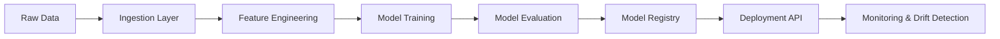

```mermaid
flowchart LR
    A[Raw Data] --> B[Ingestion Layer]
    B --> C[Feature Engineering]
    C --> D[Model Training]
    D --> E[Model Evaluation]
    E --> F[Model Registry]
    F --> G[Deployment API]
    G --> H[Monitoring & Drift Detection]
```


```mermaid
flowchart LR
    A[Data] --> B[Feature Engineering]
    B --> C[Model Training]
    C --> D[Evaluation]
    D --> E[Deployment]
    E --> F[Monitoring]
