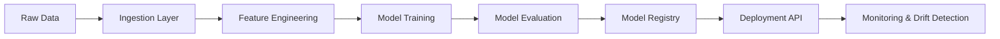

```mermaid
flowchart LR
    A[Raw Data] --> B[Ingestion Layer]
    B --> C[Feature Engineering]
    C --> D[Model Training]
    D --> E[Model Evaluation]
    E --> F[Model Registry]
    F --> G[Deployment API]
    G --> H[Monitoring & Drift Detection]
```


```mermaid
flowchart LR
    A[The] --> B[cat]
    B --> C[sat]
    C --> D[on]
    D --> E[the]
    E --> F[mat]
    F --> G["Early info fades"]
