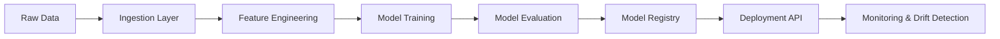
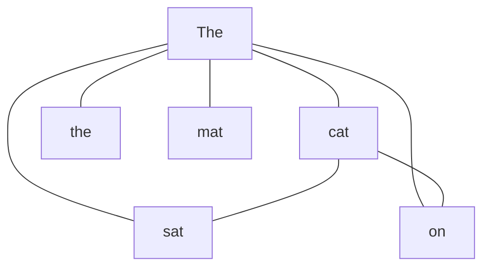

```mermaid
flowchart LR
    A[Raw Data] --> B[Ingestion Layer]
    B --> C[Feature Engineering]
    C --> D[Model Training]
    D --> E[Model Evaluation]
    E --> F[Model Registry]
    F --> G[Deployment API]
    G --> H[Monitoring & Drift Detection]
```

</> Markdown

```mermaid
flowchart LR
    A[The] --> B[cat] --> C[sat] --> D[on] --> E[the] --> F[mat]
```

</> Markdown

``` mermaid
flowchart TD
    A[The] --- B[cat]
    A --- C[sat]
    A --- D[on]
    A --- E[the]
    A --- F[mat]
    B --- C
    B --- D
```
