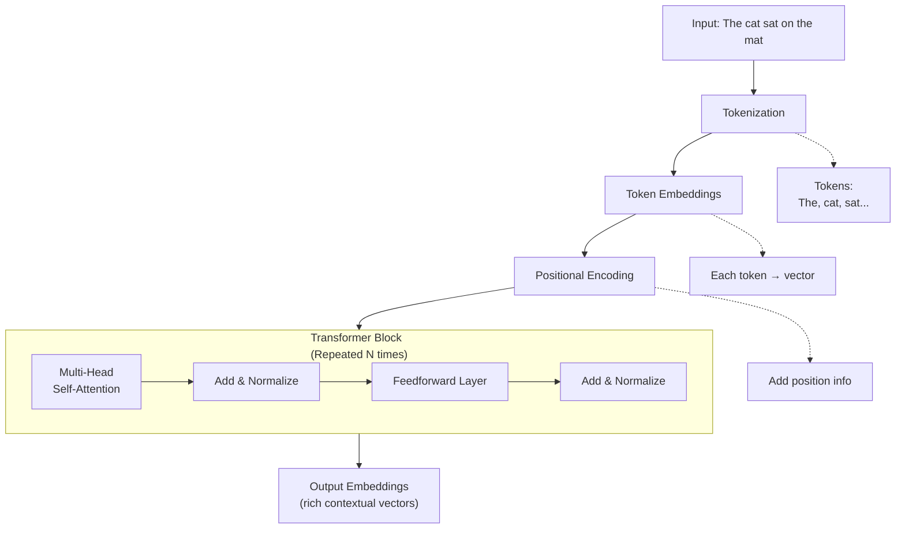

```mermaid
flowchart TD
    A["Input: The cat sat on the mat"] --> B["Tokenization"]
    B --> C["Token Embeddings"]
    C --> D["Positional Encoding"]
    D --> E

    subgraph E["Transformer Block<br/>(Repeated N times)"]
        F["Multi-Head<br/>Self-Attention"] --> G["Add & Normalize"]
        G --> H["Feedforward Layer"]
        H --> I["Add & Normalize"]
    end

    E --> J["Output Embeddings<br/>(rich contextual vectors)"]

    B -.-> Bnote["Tokens:<br/>The, cat, sat..."]
    C -.-> Cnote["Each token → vector"]
    D -.-> Dnote["Add position info"]
```


https://poloclub.github.io/transformer-explainer/
https://www.youtube.com/watch?v=aircAruvnKk&list=PLZHQObOWTQDNU6R1_67000Dx_ZCJB-3pi
```
